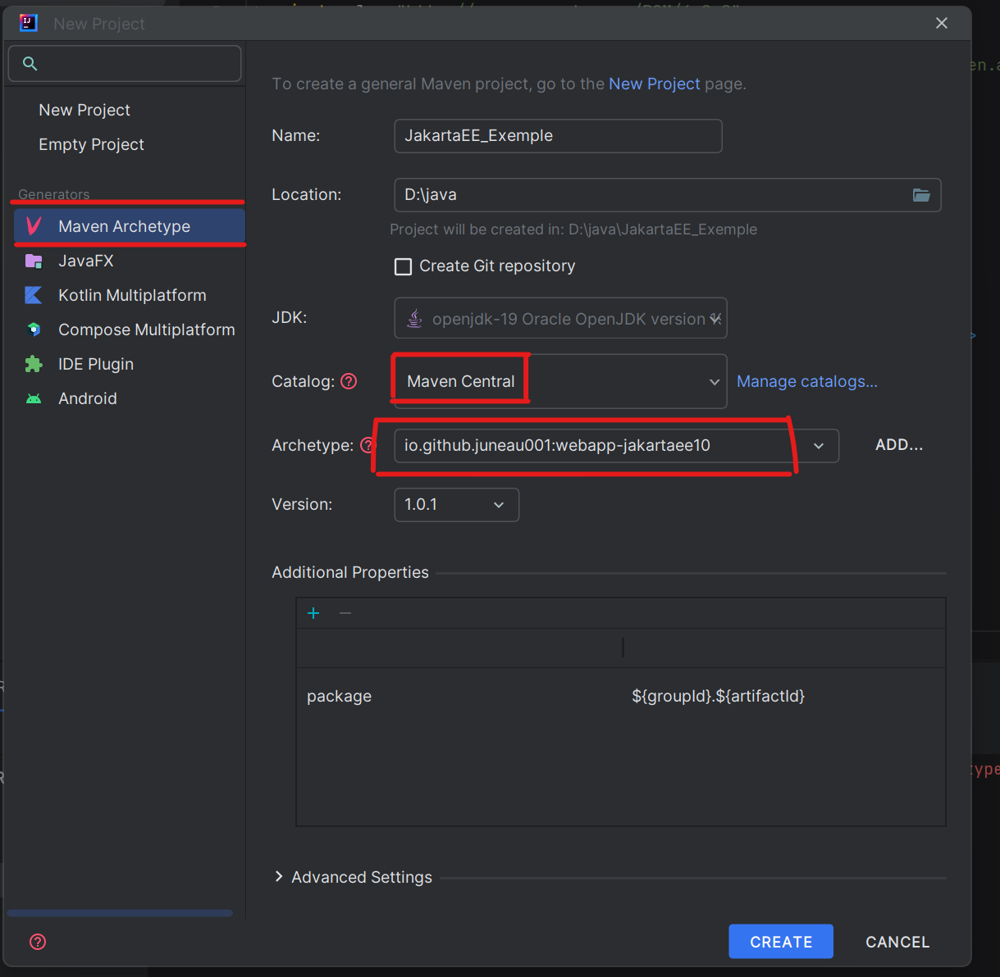
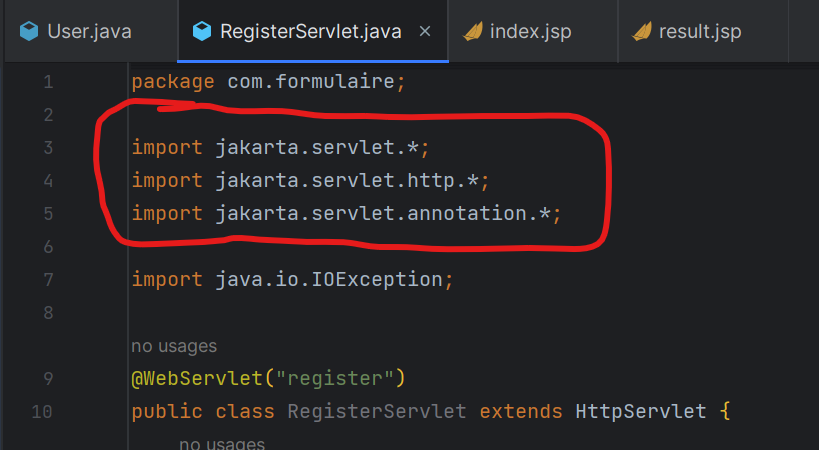
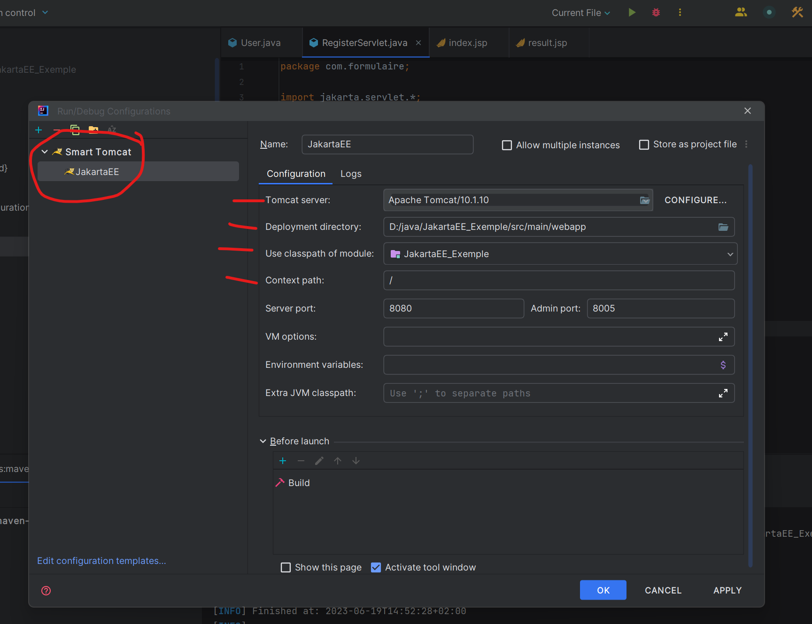

# Projet d'exemple Jakarta EE avec IntelliJ Community et Tomcat

Ce projet d'exemple vous montre comment configurer un projet Jakarta EE dans IntelliJ Community et comment importer la bibliothèque servlet Jakarta dans une classe Java. Il vous guide également sur la configuration de Tomcat dans IntelliJ Community.

## Étapes

1. Créez un nouveau projet dans IntelliJ Community.
   
   

2. Importez la bibliothèque servlet Jakarta et JFC dans une classe Java.
  - pour importer JFC : import jakarta.faces.*;
   
   

4. Configurez Tomcat dans IntelliJ Community.
   
   

## Téléchargement

Vous pouvez télécharger le projet d'exemple complet au format ZIP en cliquant sur le lien suivant : [JakartaEE_Exemple.zip](JakartaEE_Exemple.zip)

## Remarque

Ce projet d'exemple est fourni à des fins d'illustration et de démonstration uniquement. Il est conçu pour vous aider à comprendre les bases de la configuration Jakarta EE avec IntelliJ Community et Tomcat.

N'hésitez pas à explorer le code source et à l'utiliser comme point de départ pour vos propres projets Jakarta EE !

